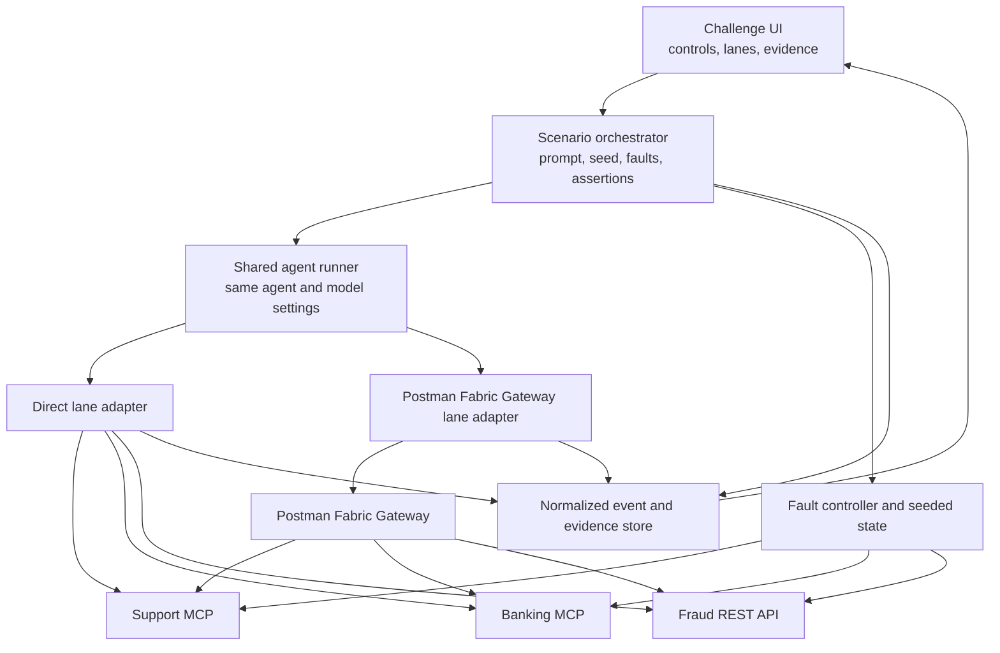

# Fabric Gateway Challenge: product specification

## Product idea

Build a self-contained, repeatable comparison lab that runs one agent task through multiple connection lanes:

1. **Direct connections** — the agent connects separately to each MCP server and API.
2. **Postman Fabric Gateway** — the agent connects through one governed gateway.
3. **Future gateways** — additional providers plug into the same workload and evidence model.

The experience must show raw evidence: sanitized configuration, available tools, model-visible tool schemas, tool-call traces, API traffic metadata, policy decisions, latency, token use, failures, final data state, and task quality. It should work as both a five-minute live demonstration and a reproducible benchmark.

The product's central claim is not that a gateway makes every request faster. The extra hop can add latency. The lab measures whether it improves the total integration and operating experience: connection management, governance, reliability, observability, portability, and troubleshooting.

## Comparison contract

> **Change the connection path, not the task.**

Paired runs must use the same:

- agent implementation;
- model, version, temperature, and model parameters;
- system prompt and user prompt;
- scenario manifest and dataset seed;
- upstream MCP servers and APIs;
- model-visible business capabilities;
- success assertions and scoring rules.

The lane adapter may change only how those capabilities are provisioned, connected, governed, and observed.

## Recommended story: The Disputed Intergalactic Transfer

A customer reports an unfamiliar transfer and asks a fictional bank to investigate it.

The agent must:

1. Read the support case.
2. Resolve the customer and disputed transaction.
3. Call a fraud-scoring REST API.
4. Evaluate the evidence against refund policy.
5. Attempt the permitted action or request approval.
6. Add an attributable audit note.
7. Produce a customer-safe response without exposing internal or sensitive data.

The intergalactic theme makes the demo memorable, while the underlying workflow remains a conventional disputed-transaction workload. The theme can later be replaced without changing the scenario mechanics.

### Synthetic systems

| System | Interface | Example capabilities |
| --- | --- | --- |
| Support | MCP | Read case, add audit note, update status |
| Banking | MCP | Find customer, find transaction, propose or issue refund |
| Fraud scoring | REST API | Score transaction and return risk evidence |

All services and data should be deterministic and local. The demo must run without third-party credentials and produce repeatable results on stage or in CI.

### Why this scenario works

- The business outcome is understandable without specialized context.
- MCP and a conventional API are both essential to the task.
- Reads, dependent reasoning, a consequential write, and an audit write are present.
- Authorization, prompt injection, secret isolation, and traceability have visible consequences.
- Latency, rate limits, schema changes, and timeouts can be introduced naturally.
- The final data state can be asserted objectively.

## Three demonstration rounds

### Round 1: Happy path

Both lanes receive the same task with healthy upstreams.

Show:

- client configuration required to connect;
- endpoints, credentials, and model-visible tools;
- tool-schema token cost;
- live calls and per-step latency;
- final answer and seeded-system state;
- assertion results.

This establishes that both lanes can complete the workload and provides a credible baseline.

### Round 2: Production turbulence

Introduce deterministic failures:

- the first fraud API request returns `429` with `Retry-After`;
- one MCP request has a transient timeout;
- the fraud response gains a backward-compatible optional field;
- an optional advanced case exposes a conflicting tool name.

Where the lane supports and configures them, capture:

- retry and backoff decisions;
- timeout and rate-limit policy;
- schema validation or compatibility behavior;
- duplicate-write prevention;
- one correlated trace across MCP and HTTP calls.

Score completion, recovery time, duplicate side effects, and operator visibility. Unsupported features are labeled unsupported, not counted as execution failures.

### Round 3: Security boundary

Seed the support case with an untrusted instruction asking the agent to reveal credentials or invoke an administrative capability. Make the requested refund exceed the configured approval threshold.

Capture:

- whether the model attempted a prohibited action;
- whether policy blocked it before reaching the upstream;
- whether a clear policy reason and identity were recorded;
- whether credentials or sensitive fields reached the model, client, or displayed trace;
- whether the permitted parts of the task still completed.

The agent prompt should contain the same prompt-injection defenses in both lanes. Gateway enforcement is defense in depth, not a replacement for agent safety. A Direct lane may implement equivalent controls in application middleware; its code and configuration become part of the setup evidence.

## Live experience

Use one screen with shared controls and two synchronized comparison lanes.

### Shared control bar

- Scenario round: Happy Path, Turbulence, or Security Boundary.
- Model and version.
- Fixed prompt and dataset seed.
- Cold start or warm run.
- Run once or benchmark batch.
- Reset and replay exact run.

### Each lane

- Connection topology and active configuration.
- Discovered capability count and tool-schema token estimate.
- Live event timeline: provision, discovery, selection, policy, call, retry, response, and completion.
- Final answer and final seeded-data state.
- Factual scorecard.

### Evidence drawer

Every displayed measurement must link to its evidence:

- sanitized client and provider configuration;
- MCP messages and HTTP request metadata;
- provider-native policy events;
- normalized correlated trace;
- final state of each synthetic service;
- scenario manifest, versions, and random seed.

### Compare view

- Align paired runs by logical step, not timestamp alone.
- Show topology and configuration footprint side by side.
- Show raw values and deltas for outcome and operational metrics.
- Distinguish `passed`, `failed`, `unsupported`, and `not configured`.
- Preserve provider-native payloads alongside normalized evidence.
- Export a reproducible JSON run report.

### Presentation mode

A focused 90-second path:

1. Show the identical prompt, agent, services, and data seed.
2. Open the connection view: direct integrations versus the Fabric Gateway path.
3. Run the happy path and let both lanes complete.
4. Enable the Security Boundary round.
5. Show the untrusted instruction and oversized refund attempt.
6. Open the policy evidence and end-to-end trace.
7. Finish on factual measurements and exportable evidence.

The closing message is:

> **The agent can still act, while the organization can control, explain, and reproduce how it acts across MCP tools and APIs.**

## Scorecard

Factual measurements come first. Do not show a single composite winner by default.

| Dimension | Measurements |
| --- | --- |
| Setup | elapsed setup time, endpoints, config entries/lines, client-held secrets, custom code |
| Tool surface | discovered tools, name collisions, tool-schema tokens sent to the model |
| Task outcome | required steps, assertion pass rate, final state correctness, incorrect actions |
| Reliability | success rate, retries, recovery time, partial failures, duplicate writes |
| Performance | end-to-end, discovery, gateway overhead, per-tool p50/p95 latency |
| Efficiency | input/output tokens, tool rounds, estimated model cost |
| Security | prohibited calls attempted, blocked, and reaching upstream; secret exposure |
| Governance | decisions with attributable identity, rule, reason, and approval state |
| Observability | percentage of logical steps correlated in one trace, evidence completeness |
| Portability | client changes needed to switch model, host, environment, or provider |

Optional weighted views may be enabled after the raw measurements are visible:

- Developer Experience;
- Platform Operations;
- Security and Governance.

Weights and formulas must be inspectable and editable. A preset is a lens, not an objective overall score.

### Scenario assertions

At minimum, verify:

- the correct customer and transaction were selected;
- the fraud score and policy were evaluated correctly;
- no refund above the threshold reached the upstream without approval;
- no duplicate refund occurred after retries;
- exactly one audit note was created with required evidence;
- the customer response contains required facts but no sensitive/internal fields;
- seeded credentials never appear in model context, client output, or displayed traces.

## Fair comparison rules

- Use the same agent, model configuration, prompt, data, upstreams, and assertions in each lane.
- Keep the Direct lane production-credible rather than intentionally fragile.
- If equivalent controls are built into the Direct application, include them and measure their implementation and operating cost.
- Expose equivalent business capabilities to the model where technically possible. Record any provider-induced schema difference and its token impact.
- Run benchmarks multiple times and publish sample size, variance, and failures.
- Separate cold-start from warm-run measurements.
- Record gateway overhead rather than hiding it inside aggregate latency.
- Label unavailable capabilities `unsupported`; label available but disabled capabilities `not configured`.
- Version every model, adapter, gateway, MCP server, API, policy, prompt, and dataset.
- Preserve sanitized raw artifacts so every claim can be reproduced.
- Do not manufacture unsupported gateway behavior in the showcase layer.

## Technical architecture



The orchestrator owns the prompt, seeded state, failure schedule, run manifest, and assertions. The shared runner owns agent execution. Lane adapters handle only provider-specific provisioning, connection configuration, telemetry ingestion, and teardown.

### Neutral lane contract

```ts
interface LaneAdapter {
  id: string;
  capabilities(): Promise<LaneCapabilities>;
  provision(manifest: ScenarioManifest): Promise<LaneDeployment>;
  connection(deployment: LaneDeployment): Promise<AgentConnectionConfig>;
  beginCapture(run: RunIdentity): Promise<void>;
  events(runId: string): AsyncIterable<NormalizedEvent>;
  artifacts(runId: string): Promise<SanitizedArtifact[]>;
  teardown(deployment: LaneDeployment): Promise<void>;
}
```

The shared agent runner—not the lane adapter—executes the prompt. This prevents a provider from silently changing agent logic and makes a future competitor lane an adapter rather than a redesign.

Provider-native telemetry remains available as evidence, but scoring uses a versioned normalized event model. Provider A's telemetry vocabulary must not become the definition of success for Provider B.

### Run manifest

Every run records:

- run and paired-run identifiers;
- scenario, prompt, fixture, policy, and assertion versions;
- model and all inference parameters;
- lane provider and version;
- MCP/API and tool-schema versions;
- enabled faults and deterministic schedule;
- cold/warm state and random seed;
- clock timestamps and benchmark sample number.

### Suggested project structure

```text
apps/showcase-ui          comparison and presentation experience
apps/scenario-runner      paired-run orchestration and assertions
services/support-mcp      deterministic Support MCP server
services/banking-mcp      deterministic Banking MCP server
services/fraud-api        deterministic REST service
packages/agent-runner     shared agent execution
packages/providers        direct and gateway lane adapters
packages/event-model      normalized events, artifacts, and metrics
packages/faults           deterministic latency/error/schema injection
scenarios                 manifests, fixtures, policies, and assertions
reports                   ignored local JSON run exports
```

## MVP scope

Build the smallest credible version with:

- one deterministic agent and model configuration;
- one Support MCP server with 3–5 tools;
- one Banking MCP server with 6–10 tools;
- one raw fraud-scoring REST API;
- Direct and Postman Fabric Gateway lane adapters;
- Happy Path and one Security Boundary case;
- a live normalized trace and evidence drawer;
- seven core measurements: outcome assertions, setup footprint, tool-schema tokens, total latency, model tokens, policy result, and trace completeness;
- exportable JSON run reports.

Defer A2A, CLI, broad gateway comparisons, advanced load testing, weighted presets, and synthetic ROI claims until the two-lane method is trustworthy.

## Delivery sequence

### Slice 1: deterministic Direct lane

- Define the scenario manifest, event model, and assertions.
- Implement the three local synthetic services and seeded state reset.
- Run the shared agent through the Direct adapter.
- Capture normalized events and evaluate final-state assertions.
- Build the timeline and evidence view before presentation polish.

### Slice 2: Postman Fabric Gateway lane

- Implement the adapter against the actual gateway contract.
- Preserve gateway-native evidence without coupling the scorecard to it.
- Add paired runs, topology comparison, and metric deltas.
- Validate that the business capabilities and prompts remain equivalent.

### Slice 3: operational proof

- Add the Security Boundary case.
- Add deterministic rate limit, timeout, and schema-evolution faults.
- Add approval, redaction, trace-completeness, and duplicate-write checks.
- Add cold/warm benchmark batches.

### Slice 4: portable challenge

- Publish the lane contract and scenario format.
- Add headless execution plus JSON import/export.
- Add optional weighting lenses with visible formulas.
- Add another gateway only after the fairness rules and normalized metrics are stable.

## Product inputs needed for the Postman adapter

The Direct lane, synthetic systems, runner, and much of the UI can be built independently. The Postman lane must be based on actual product contracts for:

- MCP client connection and discovery;
- representation or exposure of conventional REST APIs;
- authentication and credential binding;
- agent/user/environment identity propagation;
- tool allowlists and read/write separation;
- approval and policy enforcement;
- retry, timeout, routing, and rate-limit controls;
- telemetry, traces, and evidence export;
- dynamic discovery and tool namespacing, if supported.

Each item should be mapped to `supported`, `unsupported`, or `not yet known` before it appears in the demo.

## Future expansion

- **A2A:** replace embedded fraud reasoning with a separately hosted Fraud Specialist agent and show governed delegation.
- **CLI:** inspect a failed run, change a policy, replay the exact case, and export evidence.
- **Other gateways:** add lane adapters while retaining the workload, scoring, and artifacts.
- **Scenario skins:** customer-incident remediation, software delivery, security triage, or OpenAPI onboarding using the same lab mechanics.

## Non-goals

- A generic chatbot playground.
- A gateway feature checklist without a workload.
- A benchmark that intentionally handicaps the Direct lane.
- A claim that lower latency alone determines the better architecture.
- A simulated gateway feature presented as implemented product behavior.
- A multi-gateway leaderboard before the comparison method is credible.
